# robotframework-seleniumtobrowser

---

## Introduction

Robot Framework SeleniumToBrowser library helps with converting automated tests using [SeleniumLibrary](https://github.com/robotframework/SeleniumLibrary) keywords to [Browser](https://github.com/MarketSquare/robotframework-browser) library

## Usage

A couple of considerations on how to use this library:
- Both Browser and SeleniumToBrowser must be declared inside the robot code.
- "Overlapping keywords" between Selenium and Brower, like Open Browser will need to called with the library prefix

## Conversion Guidelines
Browser library provides many keywords that are similar to the ones we have in Selenium, but the correspondence is not one-on-one. There are keywords that can be used to execute the same actions that in Selenium are executed by multiple ones.

Here you can access to the documentation of the library: [Browser Library](https://marketsquare.github.io/robotframework-browser/Browser.html.).

 

### **1. Click Element**

To click on an element with Browser, you use ‘**Click**’. This keyword will replace all the ‘Click Element’, ‘Click Button’, ‘Click Link’ and the rest of ‘click’ keywords we used in Selenium.

This keyword has implicit waits, what means that you don’t need to add ‘waits’ for the element to be visible before clicking. The timeout for the implicit wait is the one set when opening the browser at the beginning, there is no way to pass a custom timeout in this keyword. To don’t use the implicit waits, you can add the argument **force=True**.

The structure is the same, Click + selector of the element.

 [Keyword Documentation](https://marketsquare.github.io/robotframework-browser/Browser.html#Click)

 

|Selenium                 |Browser          |
|---|---|
|**Click Element**&nbsp;&nbsp;&nbsp;&nbsp;selector|**Click**&nbsp;&nbsp;&nbsp;&nbsp;selector|

 

 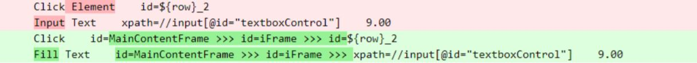

  

### **2. Select Option From Dropdown List**

In Selenium, to select an option in a select, we just use ‘Click’. With Browser, there is a specific keyword to do it: ‘Select Options By’. If you use click to select an option in a dropdown list, it doesn’t work.

The structure is: Select Options By + selector + attribute + value.

The attribute is the way you will use to select the element, could be value, label, text or index.

[Keyword Documentation](https://marketsquare.github.io/robotframework-browser/Browser.html#Select%20Options%20By)

 

|Selenium                 |Browser          |
|---|---|
|**Click Element**&nbsp;&nbsp;&nbsp;&nbsp;select_locator|**Select Options By**&nbsp;&nbsp;&nbsp;&nbsp;select_locator&nbsp;&nbsp;&nbsp;&nbsp;attribute&nbsp;&nbsp;&nbsp;&nbsp;option_value
|**Click Element**&nbsp;&nbsp;&nbsp;&nbsp;option_locator||

 

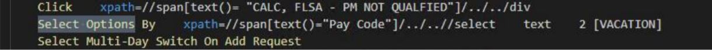

 

### **3. Select Checkbox**

Instead of using ‘Select checkbox’ as we do in Selenium, in Browser we need to use ‘Check Checkbox’ to select a checkbox.

The syntax is: Check Checkbox + selector.

[Keyword Documentation](https://marketsquare.github.io/robotframework-browser/Browser.html#Check%20Checkbox)

 

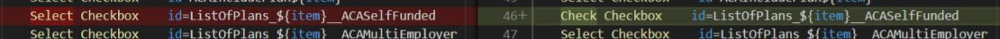

 

|Selenium                 |Browser          |
|---|---|
|**Select Checkbox**&nbsp;&nbsp;&nbsp;&nbsp;selector|**Check Checkbox**&nbsp;&nbsp;&nbsp;&nbsp;selector|

 

**Note:** This will fail if the checkbox is already checked. In that case you can first use ‘Get Checkbox State’ to know if the checkbox is already checked.

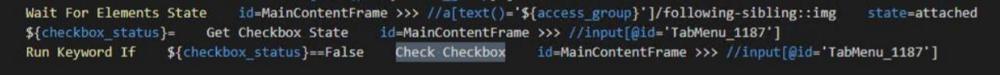

 

### **4. Unselect Checkbox**

Is the opposite to the previous keyboard. You can use ‘Uncheck Checkbox’ to uncheck a checkbox.

The syntax is: Uncheck Checkbox + selector.

[Keyword Documentation](https://marketsquare.github.io/robotframework-browser/Browser.html#Uncheck%20Checkbox)

 

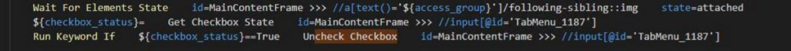

 

|Selenium                 |Browser          |
|---|---|
|**Unselect Checkbox**&nbsp;&nbsp;&nbsp;&nbsp;selector|**Uncheck Checkbox**&nbsp;&nbsp;&nbsp;&nbsp;selector|

 

### **5. Input Text**

To migrate from Selenium to Browser, you need to replace all the ‘Input Text’ with ‘Fill Text’. The syntax is the same and the behavior too. It will add the sent text to the field all at once. If you need to input the text simulating typing you can use ‘Type Text’.

Syntax: Fill text + selector + text

[Keyword Documentation](https://marketsquare.github.io/robotframework-browser/Browser.html#Fill%20Text)

 

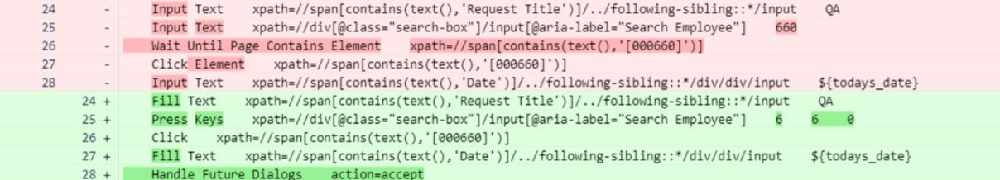

 

|Selenium                 |Browser          |
|---|---|
|**Input Text**&nbsp;&nbsp;&nbsp;&nbsp;selector&nbsp;&nbsp;&nbsp;&nbsp;text|**Fill Text**&nbsp;&nbsp;&nbsp;&nbsp;selector&nbsp;&nbsp;&nbsp;&nbsp;text|

 

### **6. Press Keys**

The keyword has the same name as browser one. In this case you don’t need to replace anything, it will work as it was before.

[Keyword Documentation](https://marketsquare.github.io/robotframework-browser/Browser.html#Press%20Keys)

 

### **7. Mouse Over**

The keyword ‘Hover’ will replace the ‘Mouse Over’ keyword from Selenium library. The syntax is the same, you just need to pass the locator for the element.

Syntax: Hover + locator

[Keyword Documentation](https://marketsquare.github.io/robotframework-browser/Browser.html#Hover)

 

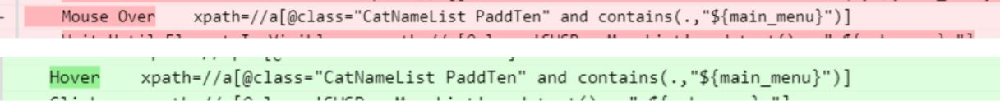

 

|Selenium                 |Browser          |
|---|---|
|**Mouse Over**&nbsp;&nbsp;&nbsp;&nbsp;selector|**Hover**&nbsp;&nbsp;&nbsp;&nbsp;selector|

 

### **8. Scroll To Element**

As you know, we usually use javascript to scroll to an element. Browser provides a keyword called ‘Scroll To’ but in reality, you won’t need to use it in most of the cases. Browser does it implicity when using ‘Click’ for example.

 

### **9. Wait Until Element Is Visible**

In Browser we have ‘Wait For Elements State’. This keyword can replace multiple keywords from Selenium. It accepts arguments, so you can check for the state you need: attached, detached, visible, hidden, enabled, disabled, etc. Here you can see all the accepted attributes: [Element States](https://marketsquare.github.io/robotframework-browser/Browser.html#ElementState)

By default, the attribute that is verified is ‘visible’. So when you use: ‘Wait For Elements State + selector’ without adding the explicit attribute, the test will wait until the element is visible. This will replace then ‘Wait Until Element Is Visible’.

[Keyword Documentation](https://marketsquare.github.io/robotframework-browser/Browser.html#Wait%20For%20Elements%20State)

 

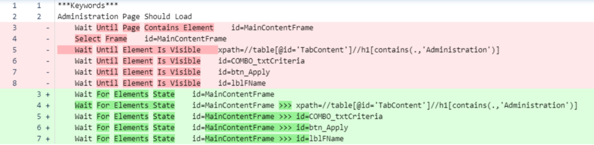

 

|Selenium                 |Browser          |
|---|---|
|**Wait Until Element Is Visible**&nbsp;&nbsp;&nbsp;&nbsp;selector|**Wait For Elements State**&nbsp;&nbsp;&nbsp;&nbsp;selector|

 

### **10. Wait Until Element Is Not Visible**

View 9. for description.

 

|Selenium                 |Browser          |
|---|---|
|**Wait Until Element Is Not Visible**&nbsp;&nbsp;&nbsp;&nbsp;selector|**Wait For Elements State**&nbsp;&nbsp;&nbsp;&nbsp;selector&nbsp;&nbsp;&nbsp;&nbsp;hidden|

 

### **11. Wait Until Element Is Enabled**

View 9. for description.

 

|Selenium                 |Browser          |
|---|---|
|**Wait Until Element Is Enabled**&nbsp;&nbsp;&nbsp;&nbsp;selector|**Wait For Elements State**&nbsp;&nbsp;&nbsp;&nbsp;selector&nbsp;&nbsp;&nbsp;&nbsp;enabled|

 

### **12. Wait Until Page Contains Element**

View 9. for description.

 

|Selenium                 |Browser          |
|---|---|
|**Wait Until Page Contains Element**&nbsp;&nbsp;&nbsp;&nbsp;selector|**Wait For Elements State**&nbsp;&nbsp;&nbsp;&nbsp;selector&nbsp;&nbsp;&nbsp;&nbsp;attached|

 

### **13. Wait Until Page Does Not Contain Element**

View 9. for description.

 

|Selenium                 |Browser          |
|---|---|
|**Wait Until Page Does Not Contain Element**&nbsp;&nbsp;&nbsp;&nbsp;selector|**Wait For Elements State**&nbsp;&nbsp;&nbsp;&nbsp;selector&nbsp;&nbsp;&nbsp;&nbsp;detached|

 

### **14. Element Should Be Visible**

In Browser we use ‘Get Element State’ to verify the status of an element. This keyword is useful to verified that an element has the expected state. You can verify from multiple attributes, like in the previous keyword ([Element States](https://marketsquare.github.io/robotframework-browser/Browser.html#ElementStateKey)) and the default one is ‘visible’. In the practice it will replace all the ‘Element Should Be’ keywords.

By default, this keyword verified that the attribute you pass is true. It returns true or false depending on the result.

[Keyword Documentation](https://marketsquare.github.io/robotframework-browser/Browser.html#Get%20Element%20State)

 

|Selenium                 |Browser          |
|---|---|
|**Element Should Be Visible**&nbsp;&nbsp;&nbsp;&nbsp;selector|**Get Element State**&nbsp;&nbsp;&nbsp;&nbsp;selector|

 

### **15. Element Should Not Be Visible**

View 14. for description.

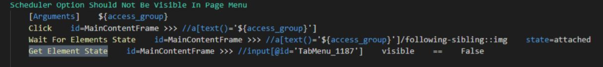

 

|Selenium                 |Browser          |
|---|---|
|**Element Should Not Be Visible**&nbsp;&nbsp;&nbsp;&nbsp;selector|**Get Element State**&nbsp;&nbsp;&nbsp;&nbsp;selector&nbsp;&nbsp;&nbsp;&nbsp;visible&nbsp;&nbsp;&nbsp;&nbsp;==&nbsp;&nbsp;&nbsp;&nbsp;False|

 

### **16. Element Should Not Be Visible**

View 14. for description.

 

|Selenium                 |Browser          |
|---|---|
|**Element Should Be Enabled**&nbsp;&nbsp;&nbsp;&nbsp;selector|**Get Element State**&nbsp;&nbsp;&nbsp;&nbsp;selector&nbsp;&nbsp;&nbsp;&nbsp;disabled&nbsp;&nbsp;&nbsp;&nbsp;==&nbsp;&nbsp;&nbsp;&nbsp;False|

 

### **17. Element Should Be Disabled**

View 14. for description.

 

|Selenium                 |Browser          |
|---|---|
|**Element Should Be Disabled**&nbsp;&nbsp;&nbsp;&nbsp;selector|**Get Element State**&nbsp;&nbsp;&nbsp;&nbsp;selector&nbsp;&nbsp;&nbsp;&nbsp;disabled|

 

### **18. Element Should Be Focused**

View 14. for description.

 

|Selenium                 |Browser          |
|---|---|
|**Element Should Be Focused**&nbsp;&nbsp;&nbsp;&nbsp;selector|**Get Element State**&nbsp;&nbsp;&nbsp;&nbsp;selector&nbsp;&nbsp;&nbsp;&nbsp;focused|

 

### **19. Page Should Contain Element**

View 14. for description.

 

|Selenium                 |Browser          |
|---|---|
|**Page Should Contain Element**&nbsp;&nbsp;&nbsp;&nbsp;selector|**Get Element State**&nbsp;&nbsp;&nbsp;&nbsp;selector&nbsp;&nbsp;&nbsp;&nbsp;attached|

 

### **20. Page Should Not Contain Element**

View 14. for description.

 

|Selenium                 |Browser          |
|---|---|
|**Page Should Not Contain Element**&nbsp;&nbsp;&nbsp;&nbsp;selector|**Get Element State**&nbsp;&nbsp;&nbsp;&nbsp;selector&nbsp;&nbsp;&nbsp;&nbsp;attached&nbsp;&nbsp;&nbsp;&nbsp;==&nbsp;&nbsp;&nbsp;&nbsp;False|

 

### **21. Checkbox Should Be Selected**

In Browser we use ‘Get Checkbox State’. It’s similar to the previous one, but specific to get the state of the checkboxes. It would replace the following keywords from Selenium. By default, the keyword will check and return true if the checkbox is unchecked.

[Keyword Documentation](https://marketsquare.github.io/robotframework-browser/Browser.html#Get%20Checkbox%20State)

 

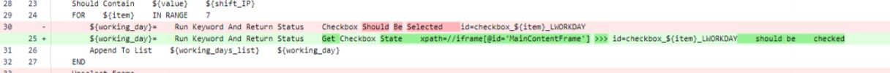

 

|Selenium                 |Browser          |
|---|---|
|**Checkbox Should Be Selected**&nbsp;&nbsp;&nbsp;&nbsp;selector|**Get Checkbox State**&nbsp;&nbsp;&nbsp;&nbsp;selector|

 

### **22. Checkbox Should Be Selected**

In Browser we use ‘Get Checkbox State’. It’s similar to the previous one, but specific to get the state of the checkboxes. It would replace the following keywords from Selenium. By default, the keyword will check and return true if the checkbox is unchecked.

[Keyword Documentation](https://marketsquare.github.io/robotframework-browser/Browser.html#Get%20Checkbox%20State)

 

 

|Selenium                 |Browser          |
|---|---|
|**Checkbox Should Be Selected**&nbsp;&nbsp;&nbsp;&nbsp;selector|**Get Checkbox State**&nbsp;&nbsp;&nbsp;&nbsp;selector|

 

### **23. Checkbox Should Not Be Selected**

In Browser we use ‘Get Checkbox State’. It’s similar to the previous one, but specific to get the state of the checkboxes. It would replace the following keywords from Selenium. By default, the keyword will check and return true if the checkbox is unchecked.

[Keyword Documentation](https://marketsquare.github.io/robotframework-browser/Browser.html#Get%20Checkbox%20State)

 

|Selenium                 |Browser          |
|---|---|
|**Checkbox Should Not Be Selected**&nbsp;&nbsp;&nbsp;&nbsp;selector|**Get Checkbox State**&nbsp;&nbsp;&nbsp;&nbsp;selector|

 

### **24. Select Frame**

Another thing to take into account when migrating to Browser, is that here we don’t have a ‘Select Frame’ keyword to search elements inside them. The way you interact with elements inside a frame, is by passing the frame locator and then the element.

For example if you want to click an element inside a frame, you should use:

Syntax: Click    frame_locator >>> element_locator

 

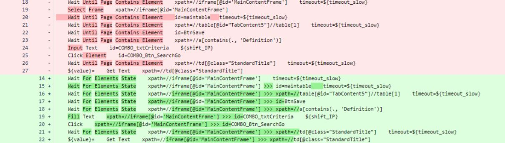

 

|Selenium                 |Browser          |
|---|---|
|**Select Frame**&nbsp;&nbsp;&nbsp;&nbsp;frame_locator|**Click**&nbsp;&nbsp;&nbsp;&nbsp;frame_locator >>> element_inside_frame|
|**Click Element**&nbsp;&nbsp;&nbsp;&nbsp;element_inside_selected_frame||

 
